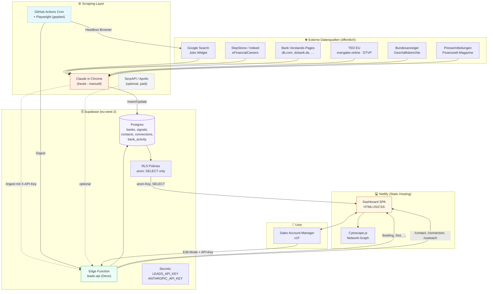
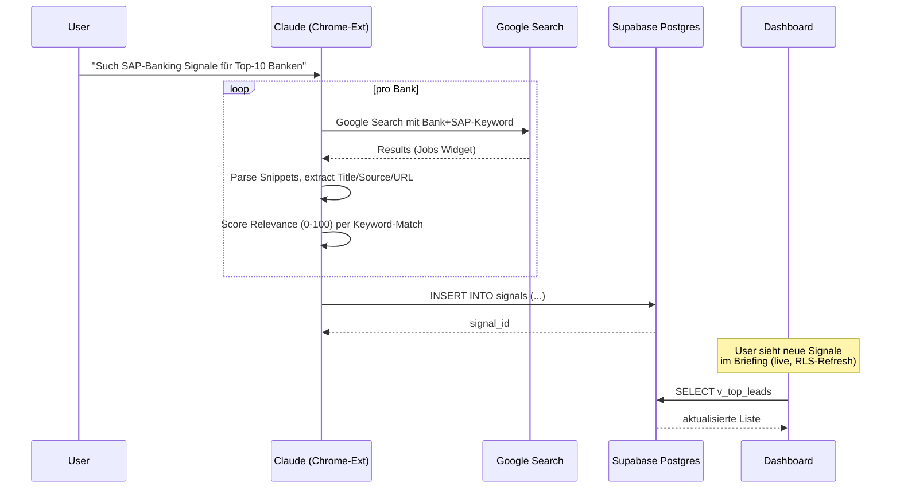
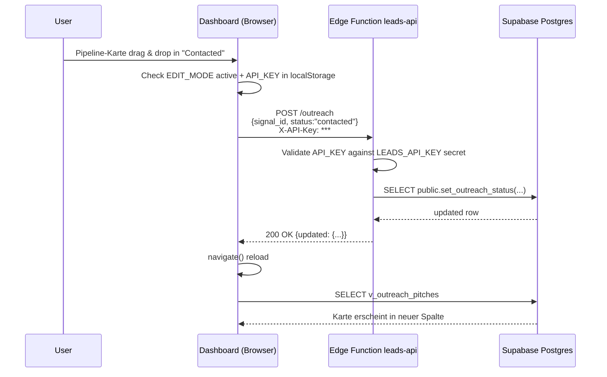
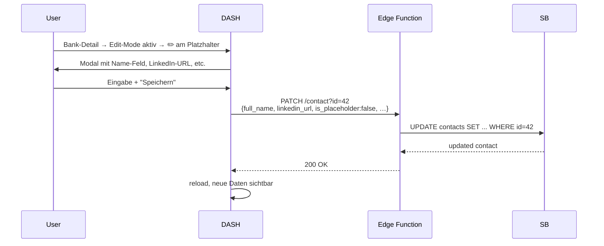
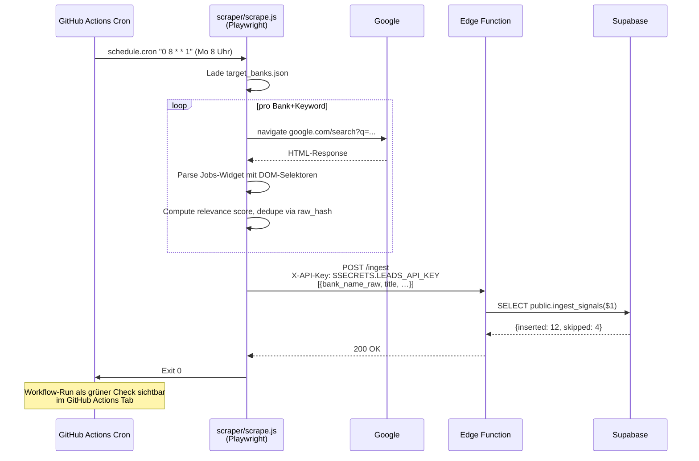
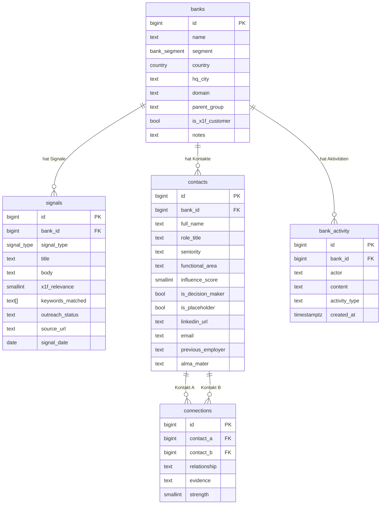

# x1F Lead-Gen — Architecture

End-to-end Architektur des x1F Lead-Generation-Systems. Erklärt, wie Daten von externen Quellen über Scraping in die Datenbank kommen, wie die API darüber liegt und wie das Dashboard sie nutzt.

---

## 1. High-Level Übersicht



---

## 2. Komponenten im Detail

### 2.1 Datenquellen

Alles **öffentlich zugänglich**, keine ToS-Probleme:

| Quelle | Was | Wie geholt |
|---|---|---|
| **Google Search Jobs-Widget** | Aggregierte Stellen aus Indeed, StepStone, eFC, LinkedIn, Workday | `q=Bankname+SAP+stelle` → Widget oben |
| **Bank Vorstands-Pages** | Aktuelle Vorstände, Aufsichtsräte | direkt: `db.com/who-we-are`, `dzbank.de/vorstand`, etc. |
| **TED EU + evergabe-online + DTVP** | Öffentliche IT-Ausschreibungen (Bundesbank, Förderbanken, Sparkassen) | Volltext-Suche per Schlagwort |
| **Bundesanzeiger** | Geschäftsberichte aller deutschen Banken/Versicherer (Pflichtveröffentlichung) | Volltext-Suche, technisch sperrig |
| **Pressemitteilungen** | Personalia, IT-Projekt-Ankündigungen, Partnerschaften | finanz-szene, finance-magazin, börsen-zeitung |

### 2.2 Scraping-Layer

**Heute (Stufe 1): manuell über mich (Claude)**
- Du fragst → ich öffne Chrome via Browser-Extension → suche → parse → INSERT in Supabase
- Vorteil: flexibel, kontextsensitiv, kein Setup
- Nachteil: skaliert nicht, abhängig von meiner Verfügbarkeit

**Halbautomatisch (Stufe 2): n8n / Make.com / Zapier**
- Cron-Trigger → externe Workflow-Engine → HTTP an `/leads-api/ingest`
- 1 Tag Setup, 0–50 €/Monat
- Kann Google Jobs-Search abrufen, parsen, weiterreichen

**Vollautomatisch (Stufe 3): GitHub Actions + Playwright** (Skeleton in `/scraper/`)
- Cron im Repo → Headless Chromium → Suche → Parse → POST `/leads-api/ingest`
- Free Tier 2000min/Monat (ca. 200× wöchentlicher Lauf)
- ✅ vollständig automatisch, versioniert, audit-bar

**Premium (Stufe 4): Apollo / Cognism API**
- B2B-Daten-Anbieter mit Decision-Maker-Datenbank
- Direkter Pull über REST API, GDPR-clean (Cognism)
- 99–700 €/Monat, sales-grade Daten

### 2.3 Supabase (Backend)

**Postgres-Tabellen**:
```
banks         (id, name, segment, country, hq_city, domain, …)
signals       (bank_id, title, x1f_relevance, signal_type, outreach_status, …)
contacts      (bank_id, full_name, role_title, seniority, influence_score, is_placeholder, …)
connections   (contact_a, contact_b, relationship, evidence, strength, …)
bank_activity (bank_id, actor, content, type, created_at)
```

**Views** (read-optimiert für Frontend):
```
heat_score, hot_signals, v_top_leads, v_outreach_pitches,
v_action_queue, v_segment_heatmap, v_bank_contacts,
v_network_nodes, v_network_edges, v_lead_full
```

**RLS Policies**:
- `anon` Rolle hat **nur SELECT** (read-only public access)
- Schreibende Operationen laufen ausschließlich über die Edge Function mit Service-Role-Key
- Keine direkten INSERT/UPDATE/DELETE aus dem Frontend möglich

**Edge Function `leads-api`** (Deno-Runtime):
- Read-Endpoints (anonym): `/briefing`, `/hot`, `/action-queue`, `/segments`, `/lead-full`
- Write-Endpoints (X-API-Key required): `/ingest`, `/outreach`, `/contact`, `/connection`, `/bank`, `/activity`, `/generate-pitch`
- API-Key wird via Supabase Secret `LEADS_API_KEY` validiert

### 2.4 Frontend (Netlify Static Hosting)

**Komplett vanilla**: HTML / JS-ES-Modules / CSS — kein Build-Step, kein React.
Auto-Deploy bei jedem `git push` zum verbundenen GitHub-Repo.

**SPA-Routing** über URL-Hash (`#/`, `#/leads`, `#/bank/123`, `#/network`, ...) — funktioniert auch auf statischem Hosting ohne Server-Rewrite-Regeln.

**Datenzugriff**:
- Read: Supabase JS SDK direkt zur Postgres-API mit Anon-Key
- Write: `fetch()` zur Edge Function mit `X-API-Key` Header (im Edit-Mode)

---

## 3. Operative Flows

### 3.1 Flow A: Neues Pain-Signal erfassen (heute, manuell via Claude)



### 3.2 Flow B: Outreach-Status setzen (User im Dashboard)



### 3.3 Flow C: Decision-Maker-Namen ergänzen



### 3.4 Flow D: Vollautomatisches Scraping (Stufe 3, geplant)



---

## 4. Datenmodell (ERD)



---

## 5. Authentication / Sicherheit

### Aktuell
| Layer | Rolle | Zugriff |
|---|---|---|
| **Frontend / anon** | Anon-Key (im JS hardcoded) | nur SELECT auf Tabellen + Views |
| **Edge Function Read** | Service-Role-Key (im Edge-Secret) | volle DB-Rechte, aber Function-intern |
| **Edge Function Write** | API-Key (`LEADS_API_KEY`) | erforderlich für alle PATCH/POST/DELETE |
| **Dashboard Edit-Mode** | API-Key in localStorage | wird im X-API-Key Header gesendet |

### Schutz vor Missbrauch
- RLS-Policy lässt anon **nur SELECT**, kein direktes Insert/Update aus dem Frontend
- API-Key validiert vor jedem Write-Vorgang in der Edge Function
- LEADS_API_KEY ist Server-Secret, nicht im Frontend-Code
- Bei Setup ohne API-Key (Dev-Modus): Function erlaubt jeden Wert → für Testumgebungen OK, für Production setzen!

### Mögliche Erweiterungen
- **Supabase Auth** (Magic-Link): mehrere User mit individuellen Rechten, Activity-Log mit user-ID
- **Netlify Password-Protection** (Pro-Plan): Dashboard nicht öffentlich
- **GitHub Branch-Protection**: nur Admin merged → kein versehentlicher Deploy

---

## 6. Tech-Stack

| Layer | Tech | Warum |
|---|---|---|
| Storage | Supabase Postgres 17 | RLS, Views, RPC, Edge-Functions in einem |
| API | Supabase Edge Function (Deno) | Same-region als DB, low-latency, deno-typesafe |
| Frontend | Vanilla HTML/JS/CSS | kein Build, einfach hosten, schnell |
| Visualization | Cytoscape.js 3.30 | beste Graph-Lib für Browser, vom CDN |
| Scraping (manual) | Claude in Chrome (Anthropic Browser-Extension) | nutzt echten Browser, ToS-konform |
| Scraping (auto) | Playwright + GitHub Actions Cron | gratis, versioniert, einfach |
| Hosting | Netlify static | Auto-Deploy ab `git push`, CDN, free tier |
| Auth | API-Key | minimale Komplexität, ausreichend für Solo |

---

## 7. Skalierungs-Pfade

### Wenn die Datenmenge wächst (>10k Signale)
- Postgres Indizes auf `signals.captured_at`, `signals.bank_id`, `signals.x1f_relevance` (sind drin)
- Materialized View statt regulärer View für `heat_score` (regelmäßig refresh via pg_cron)
- Pagination im Dashboard (statt LIMIT 500)

### Wenn das Sales-Team wächst (>3 User)
- Supabase Auth mit Magic-Link
- Activity-Log per User-ID
- "Mein Lead-Pool" Filter im Dashboard
- Kanban: Karten "Owner" zuweisen

### Wenn mehrere Branchen abgedeckt werden (FSI + Public + Industrie)
- `industry` Spalte in banks (heute: `segment`)
- Pro Industrie eigene Pitch-Templates
- Dashboard Multi-Industry-Filter

### Wenn von Manual-Scraping wegmigriert
- GitHub Actions täglich/wöchentlich
- Diff-Logik: nur **neue** Signale insertieren (raw_hash dedupliziert bereits)
- Alert via Slack-Webhook bei `x1f_relevance >= 80` neu eingetroffen

### Wenn Apollo/Cognism dazukommt
- Edge Function `/enrich-contact` ruft Apollo-API mit name+company → ergänzt LinkedIn, E-Mail, Phone
- Cron-Job einmal pro Woche für alle `is_placeholder=false AND linkedin_url IS NULL`

---

## 8. Quick-Reference: wer macht was

| Aktion | Wer triggert | Wie | Ergebnis |
|---|---|---|---|
| Neue Signale scrapen | User → mich (Claude) | Chat | INSERT in DB |
| Neue Signale ingesten | externer Worker | POST /ingest | INSERT, dedupliziert via raw_hash |
| Echten Namen ergänzen | User im Dashboard | ✏️-Modal | PATCH /contact |
| Outreach-Status setzen | User per Drag&Drop | Pipeline Kanban | POST /outreach |
| Connection anlegen | User im Dashboard | "+ Connection" Modal | POST /connection |
| Bank-Notiz hinzufügen | User im Dashboard | Notiz-Feld in Stammdaten | PATCH /bank oder POST /activity |
| Briefing generieren | User | Lädt `#/` | SELECT v_top_leads, hot_signals |

---

## 9. Files & Ordner

```
/Users/lom/Developer/x1f-leads-dashboard/
├── index.html              # SPA shell + nav
├── styles.css              # light theme (+ dark, print)
├── app.js                  # SPA logic, router, edit mode
├── netlify.toml            # static hosting config
├── README.md               # benutzer-doku
├── ARCHITECTURE.md         # dieses dokument
└── scraper/                # geplant: GitHub-Actions-Worker
    ├── scrape.js           # Playwright + Google + POST /ingest
    ├── package.json
    └── target_banks.json
└── .github/workflows/
    └── scrape.yml          # cron + run scraper

Supabase Projekt: wlxolfkhkxembiuofmfa
├── DB schema "public":     banks, signals, contacts, connections, bank_activity
├── Edge Function:          leads-api (v2)
└── Secrets:                LEADS_API_KEY, ANTHROPIC_API_KEY (für Pitch-Gen)
```
